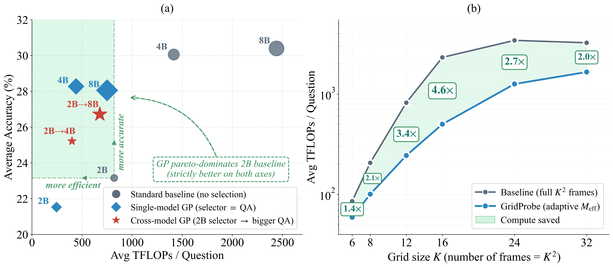
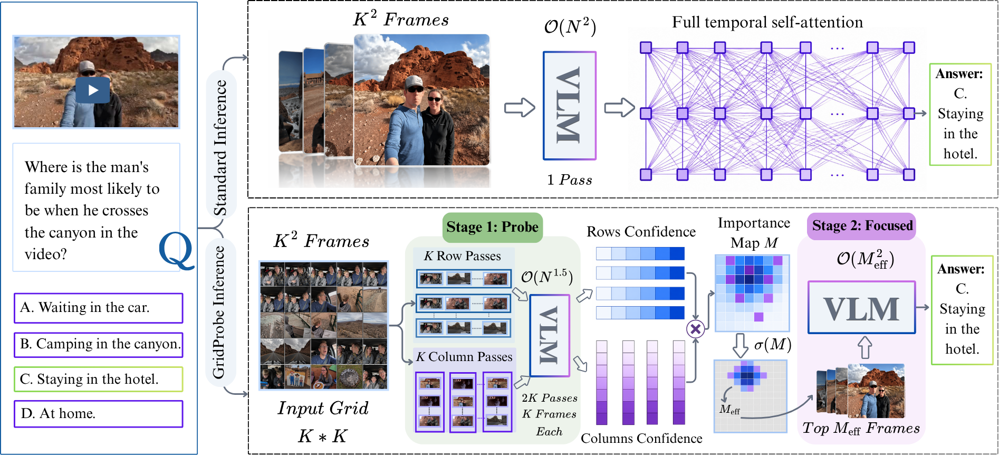
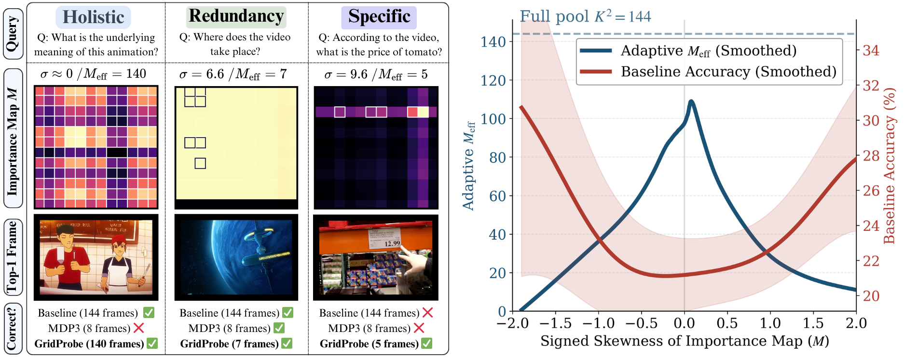

# GridProbe: Posterior-Probing for Adaptive Test-Time Compute in Long-Video VLMs
**Authors:** Mohamed Eltahir, Lama Ayash, Ali Habibullah, Tanveer Hussain and Naeemullah Khan.

<div align="center">

[](https://arxiv.org/abs/XXXX.XXXXX)

</div>

<div align="center">
  
  <p><em>(a) Video-MME-v2 Pareto across QA model sizes. GridProbe variants in the green region Pareto-dominate the 2B baseline (higher accuracy at lower compute). (b) Compute reduction across K at fixed 2B QA. The compute-reduction ratio is hump-shaped in K, peaking at 4.6× near K=16.</em></p>
</div>


---

## Highlights
- **Posterior-probing inference paradigm**: A sub-quadratic training-free inference method for long-video VLMs that operates in **answer space** (via the VLM's own posterior) rather than encoder space (CLIP-like similarity), replacing the standard one-shot forward pass.
- **Question-conditioned importance map**: A per-question, frame-level importance map exposes the VLM's evidence-gathering for each query, making long-video understanding **interpretable** at the frame level.
- **Shape-driven adaptive test-time compute**: A closed-form statistic on the importance map distribution replaces the fixed frame budget `M` with a per-question `M_eff` that adapts to question difficulty.
- **The Redundancy Principle**: Positive-skew (sparse peaks) and negative-skew (redundant high-importance) maps are different distribution shapes that share the same selection answer.
- **Plug-and-play**: Works out-of-the-box with any Qwen3-VL backbone (2B / 4B / 8B). No fine-tuning, no LoRA, no adapter weights.
---


## News
- [2026-05] arXiv preprint released.
---


## Methodology
<div align="center">
  
  <p><em>GridProbe pipeline. Stage 1: 2K row/column probes on K² candidate frames yield an interpretable importance map. Stage 2: one focused pass on the top-M_eff frames, sized adaptively from the map's distribution shape.</em></p>
</div>

---
## Results

<div align="center">
  
  <p><em><b>Left:</b> three VMME-V2 queries exercise three distribution-shape regimes (Holistic, Redundancy, Specific). For each we show the question, importance map M, the top-1 selected frame, and per-method correctness. GridProbe answers all three correctly; MDP3 (paper-default fixed M=8) misses Holistic and Specific. <b>Right:</b> GridProbe's adaptive M_eff (blue) and the 2B baseline accuracy (red), smoothed across signed skew(M) on VMME-V2. The two curves mirror each other: both signed extremes route to small M_eff on intrinsically easier questions, while the near-uniform middle gets near-K² coverage on intrinsically harder ones.</em></p>
</div>

# Guide for GridProbe

## 🧩 Prerequisites
- Python **3.10+**
- CUDA-compatible GPU (**A100** or better recommended)
- `conda` or `pip` package manager

---

## ⚙️ Installation


```bash
# Clone the repository
git clone https://github.com/mohammad2012191/GridProbe.git
cd GridProbe

# Install dependencies
pip install -r requirements.txt
```


---
## Required Data to Reproduce

1. **Video-MME-v2** : download from the [official Video-MME-v2 release](https://huggingface.co/datasets/lmms-lab/Video-MME-2) and point `--data_dir` at the root containing videos and parquet metadata.
2. **LongVideoBench** : download from the [official LongVideoBench release](https://huggingface.co/datasets/longvideobench/LongVideoBench), point `--lvb_json` at the validation `.jsonl` and `--lvb_dir` at the video/subtitle directory.

---

## GridProbe Usage Guide

### Single-Model GridProbe (GP-X)


```bash
python -m GridProbe.eval.two_stage_eval \
  --benchmark video_mme_v2 \
  --data_dir /path/to/Video-MME-v2 \
  --vlm_model Qwen/Qwen3-VL-2B-Instruct \
  --K 12 --M auto --selector skew \
  --n_samples 0 \
  --output results/ts_v2_2B_K12_auto.json
```

Swap `--vlm_model` to `Qwen/Qwen3-VL-4B-Instruct` or `Qwen/Qwen3-VL-8B-Instruct` for GP-4B / GP-8B.

For LongVideoBench (with subtitles):

```bash
python -m GridProbe.eval.two_stage_eval \
  --benchmark lvb \
  --lvb_json /path/to/lvb_val.jsonl --lvb_dir /path/to/lvb_videos \
  --with_subtitle \
  --vlm_model Qwen/Qwen3-VL-2B-Instruct \
  --K 12 --M auto --selector skew \
  --output results/ts_lvb_2B_K12_auto.json
```

### Cross-Model GridProbe (GP-2B → 8B)


```bash
python -m GridProbe.eval.two_stage_eval_crossmodel \
  --benchmark video_mme_v2 \
  --data_dir /path/to/Video-MME-v2 \
  --selector_model Qwen/Qwen3-VL-2B-Instruct \
  --qa_model Qwen/Qwen3-VL-8B-Instruct \
  --K 12 --M auto --selector skew \
  --output results/ts_v2_crossmodel_2B_to_8B.json
```

The `Uniform-M_eff → 8B` matched-compute control adds the flag `--uniform_M_eff` (uses GridProbe's per-question `M_eff` but draws those frames uniformly from the K² pool):

```bash
python -m GridProbe.eval.two_stage_eval_crossmodel \
  --benchmark video_mme_v2 \
  --data_dir /path/to/Video-MME-v2 \
  --selector_model Qwen/Qwen3-VL-2B-Instruct \
  --qa_model Qwen/Qwen3-VL-8B-Instruct \
  --K 12 --M auto --uniform_M_eff \
  --output results/ts_v2_uniform_Meff_to_8B.json
```

### Analysis and Reporting

Per-method aggregate accuracy + FLOPs:

```bash
python -m GridProbe.eval.analyze_results \
  --input results/ts_v2_2B_K12_auto.json \
  --parquet /path/to/Video-MME-v2/test.parquet \
  --out_dir analysis/v2_2B_auto/
```

---

## Configuration Parameters

### Required Arguments

| Parameter | Description | Example |
|-----------|-------------|---------|
| `--benchmark` | Benchmark name | `video_mme_v2`, `lvb` |
| `--data_dir` | V2 video / parquet root | `/path/to/Video-MME-v2` |
| `--lvb_json` | LVB validation JSONL (LVB only) | `/path/to/lvb_val.jsonl` |
| `--lvb_dir` | LVB video / subtitle directory (LVB only) | `/path/to/lvb_videos` |
| `--vlm_model` | HuggingFace model id | `Qwen/Qwen3-VL-2B-Instruct` |
| `--K` | Grid side (K² = candidate pool size) | `12` |
| `--M` | Frame budget: integer or `auto` for per-question `M_eff` | `auto` |
| `--output` | Output JSON path | `results/ts.json` |

### Optional Arguments

| Parameter | Description | Default | Options |
|-----------|-------------|---------|---------|
| `--selector` | Adaptive-M rule (used when `--M auto`) | None | `skew`|
| `--with_subtitle` | Enable subtitles (LVB) | `False` | flag |
| `--n_samples` | Limit number of samples | `30` | `0` for all |
| `--cache_dir` | HuggingFace model cache | `None` (uses `$HF_HOME`) | path |

### Cross-Model Specific

| Parameter | Description | Example |
|-----------|-------------|---------|
| `--selector_model` | Selector VLM id | `Qwen/Qwen3-VL-2B-Instruct` |
| `--qa_model` | QA VLM id | `Qwen/Qwen3-VL-8B-Instruct` |
| `--uniform_M_eff` | Use per-question `M_eff` but draw frames uniformly (matched-compute control) | flag |

---

## 📝 Citation

If you use GridProbe in your research, please cite:


```bibtex
@misc{eltahir2026gridprobe,
      title={GridProbe: Posterior-Probing for Adaptive Test-Time Compute in Long-Video VLMs}, 
      author={Mohamed Eltahir and Lama Ayash and Ali Habibullah and Tanveer Hussain and Naeemullah Khan},
      year={2026},
      eprint={XXXX.XXXXX},
      archivePrefix={arXiv},
      primaryClass={cs.CV},
      url={https://arxiv.org/abs/XXXX.XXXXX}, 
}

```
